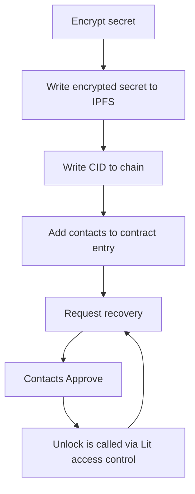

## Social Recovery Lifecycle

```mermaid
flowchart TD
	A[Encrypt secret] --> B[Write encrypted secret to IPFS];
	B --> C[Write CID to chain];
	C --> D[Add contacts to contract entry]
	D --> E[Request recovery]
	E --> F[Contacts Approve]
	F --> G[Unlock is called via Lit access control]
	G --> E
```
