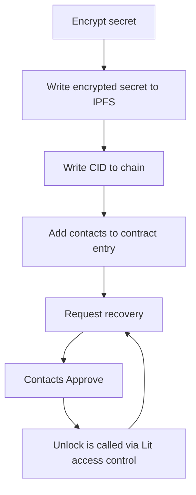

## Social Recovery

#### Terms

`secrets` - text that will stay encrypted until the recovery ceremony is completed
`contacts` - the other users/entities that need to complete the ceremony for the secret to unlock


#### Behavior

When a contract approves the unlocking of a secret the block number is recorded. On the other hand, when a secret is unlocked the block number is also recorded. The last unlock approval block number of all contracts must be greater than the block number of the last unlock action.


#### Lifecycle




#### Testing

```
make t
`````
